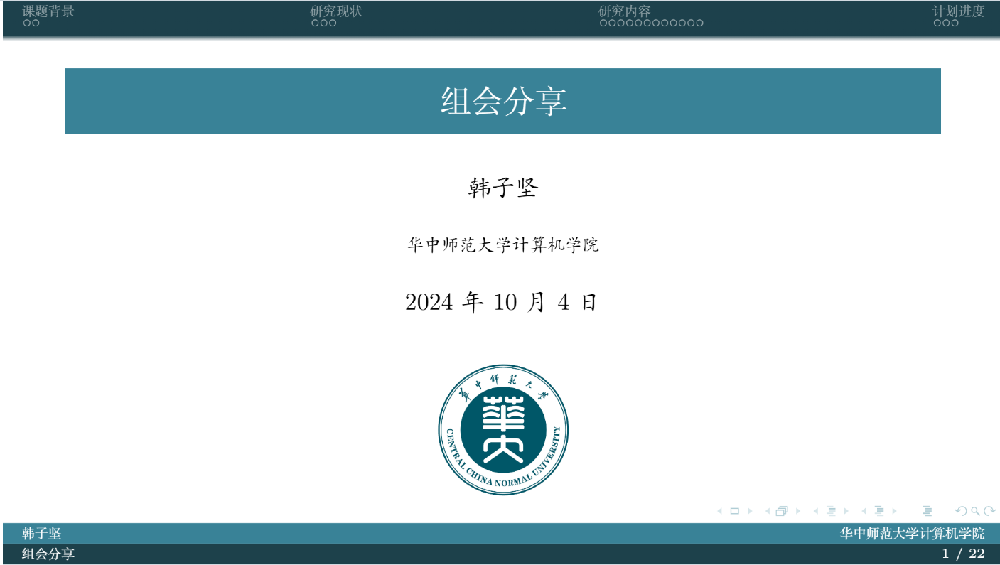

# CCNU-Beamer-Theme

## Overview

`CCNU`风格的 `Beamer`主题，可用于答辩、汇报、组会分享等.

使用校官网 `RGB(57, 130, 151)`作为底色.

## Preview

完整的编译后的 pdf 文件见 [slide.pdf](./slide.pdf)

## Example

具体的使用方法以及更加丰富的案例见 [./sample_slides](./sample_slides/)

## Makefile

由于 LaTex Workshop 的清理脚本无法清除所有中间文件，编译文件时不要使用LaTex Workshop 的编译链，而应执行 `make` 命令会自动编译 slide.tex 并清理所有的中间文件 .

为了加速编译，Makefile 提供了分段编译的功能，例如，执行 `make 0` 会只编译第 0 个 section，执行 `make 1` 会只编译第 1 个 section，而如果不加参数，执行 `make` 会编译整个 slide.tex.

如果需要新增章节，只需要在根目录下新建 new_sec.tex ，然后在 slide.tex 中 增加 `\input{new_sec.tex}` ，无需修改 Makefile.

## Usage

执行 `bash init.sh target_directory`

例如 `bash init.sh /root/github/CCNU-Beamer/sample_slides/mlm_survey` 

## Markdown Support with LLM

支持使用 markdown 编写文档，借助大模型转换为 beamer，具体的使用方法见 [./markdown](./markdown/)

步骤：
1. 在 [slide.md](./markdown/slide.md) 中编写 markdown 文件

2. 执行 `python get_img_from_md.py` 会将 markdown 文件中的图片下载到 [pic](./pic/) 目录下

3. 使用 [md2beamer_prompt.md](./markdown/md2beamer_prompt.md) 中的 prompt 借助 LLM 将 markdown 文件转换为 beamer

## Acknowledgements

本项目基于 [THU-Beamer-Theme](https://github.com/tuna/THU-Beamer-Theme)
