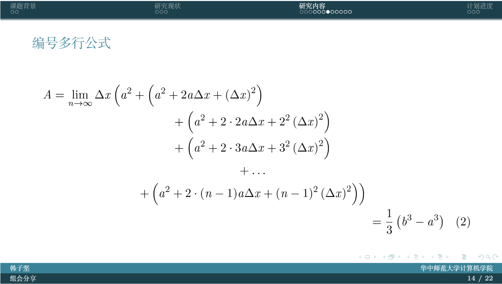

# CCNU-Beamer-Theme

## Overview

`CCNU`风格的`Beamer`主题，可用于答辩、汇报、组会分享等.

使用校官网`RGB(57, 130, 151)`作为底色.

使用方式和详细细节见源代码和`slide`.

## Preview

完整的编译后的 pdf 文件见 [slide.pdf](./slide.pdf)

##  Acknowledgements

本项目基于 [THU-Beamer-Theme](https://github.com/tuna/THU-Beamer-Theme)